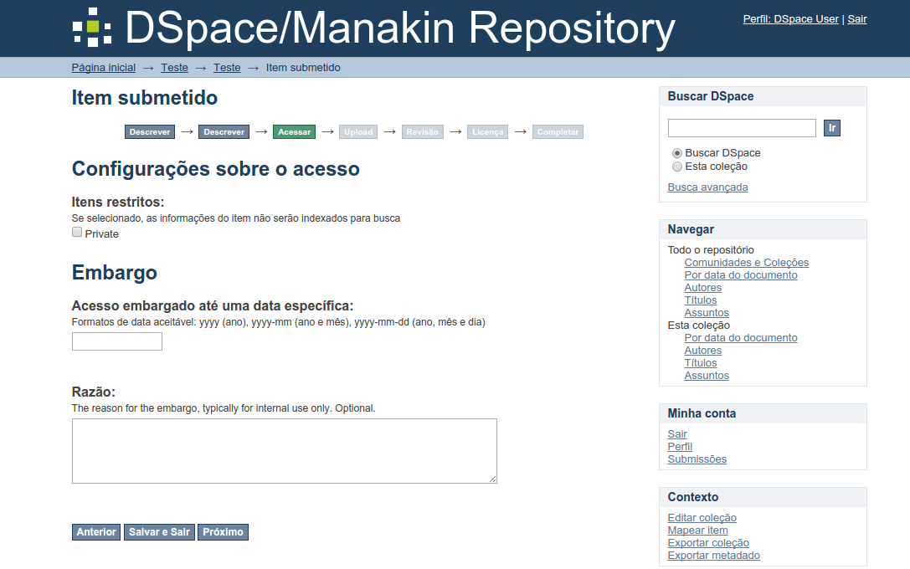
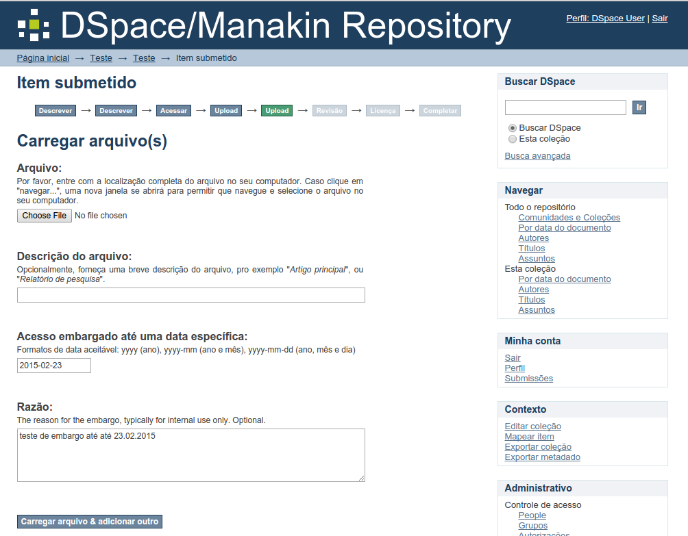

Title: Utilizando a funcionalidade de embargo no DSpace
Date: 2015-02-22 10:00
Category: DSpace

https://wiki.duraspace.org/display/DSDOC4x/Embargo

Um [Embargo][1] é uma restrição de acesso temporária colocada em metadados ou bitstreams. Sua abrangência ou duração pode variar, mas a expiração é o que a distingue de outras restrições de conteúdo. Por exemplo, é comum conteúdos no DSpace terem restrições de acesso permanente para grupos de usuários. Essas restrições são gerenciadas usando a ferramenta administrativa padrão do DSpace, incluindo políticas para coleções, itens, bitstreams, etc. 
A funcionalidade Embargo foi introduzida no DSpace 1.6 permitindo embargos sobre itens e aplicada a ***todos os bitstreams do item***. Na versão 3.0 do DSpace, essa funcionalidade foi estendida para a interface XMLUI, permitindo fazer embargo sobre ***bistreams individuais***.

Existem dois tipos de embargo no DSpace: o simples e o avançado, veremos adiante como cada um funciona.

####Embargo Simples

Quando habilitado, permite ao submitter de um novo item a possibilidade de aplicar restrição de acesso para os metadados e qualquer bitstream carregado.

Um novo step "Access" no processo de submissão permite que o submitter escolha todos os metadados do item como "private". Dessa forma, os metadados não serão pesquisáveis e o item não aparecerá nos índices de busca. Somente administradores tem acesso a esses items privados.

#####AccessStep

O formulário do step "AccessStep" no Embargo Simples exibe três opções para o usuário:

 - ***Private item***: para esconder os metadados de um item de todos os índices de pesquisa e navegação, bem como interfaces extrnas como o OAI_PMH.
 - ***Embargo Access until Specific Date***: para indicar a data até a qual o item será embargado.
 - ***Reason***: para elaborar o motivo específico para o item estar sob embargo.

Quando o Embargo é definido, ele se aplica para usuários anônimos ou para qualquer outro grupo que tenha o acesso padrão de leitura para essa coleção específica.

Veja na figura abaixo como o AccessStep é exibido:



#####UploadWithEmbargoStep

O formulário do step "UploadWithEmbargoStep" no Embargo Simples exibe dois novos campos para o usuário:

 - ***Embargo Access until Specific Date***: para indicar a data até a qual o bitstream será embargado. Se ficar vazio, nenhum embargo será aplicado.
 - ***Reason***: para elaborar o motivo específico para o bitstream estar sob embargo.

Veja na figura abaixo como o UploadWithEmbargoStep é exibido:



####Embargo Avançado

O Embargo Simples é limitado no sentido de que afeta apenas usuários anônimos e todos os grupos que têm acesso de leitura padrão.  Já o Embargo Avançado é mais poderoso, pois permite definir os embargos a grupos específicos de usuários. É aconselhável que esta funcionalidade só esteja habilitada para os usuários que conheçam quais os tipos de grupos que foram definidos no repositório, a fim de fazer um correto julgamento de quais embargos devem ser aplicados para cada grupo. 

###Habilitando o Embargo no DSpace

Veja abaixo as configurações para habilitar a funcionalidade no DSpace 3.0+.

#####Embargo simples ou avançado

######dspace.cfg

Para escolher entre os dois tipos de embargo, você deve preencher a propriedade **webui.submission.restrictstep.enableAdvancedForm** no arquivo **[dsapce]/config/dspace.cfg**. O valor padrão é false, que habilita o modo simples enquanto o valor true habilita o embargo avançado.

    webui.submission.restrictstep.enableAdvancedForm=false

#####Processo de submissão

######item-submission.xml

Para habilitar o embargo, o arquivo **[dspace]/config/item-submission.xml** também deverá ser alterado. Esse arquivo determina os steps que são executados na submissão de um novo item.
Dois novos steps são introduzidos no arquivo. Por padrão eles ainda não estão ativados:

 - **AccessStep**: step no qual o usuário define o embargo no nível de item, restringindo o acesso aos metadados do item.
 - **UploadWithEmbargoStep**: step no qual o usuário define o embargo no nível de bitstream. Se esse step estiver habilitado, o antigo *UploadStep* deve estar desabilitado. Manter os dois steps habilitados resultará numa falha de sistema.

Veja um trecho do arquivo alterado:

* Step 3 - AccessStep*
```xml
<step>
    <heading>submit.progressbar.access</heading>
    <processing-class>org.dspace.submit.step.AccessStep</processing-class>
    <jspui-binding>org.dspace.app.webui.submit.step.JSPAccessStep</jspui-binding>
    <xmlui-binding>org.dspace.app.xmlui.aspect.submission.submit.AccessStep</xmlui-binding>
    <workflow-editable>true</workflow-editable>
</step>
```

* Step 4 - UploadWithEmbargoStep*
```xml
<step>
    <heading>submit.progressbar.access</heading>
    <processing-class>org.dspace.submit.step.AccessStep</processing-class>
    <jspui-binding>org.dspace.app.webui.submit.step.JSPAccessStep</jspui-binding>
    <xmlui-binding>org.dspace.app.xmlui.aspect.submission.submit.AccessStep</xmlui-binding>
    <workflow-editable>true</workflow-editable>
</step>
```

Mais informações sobre a funcionalidade de embargo podem ser vistas na [Wiki do DSpace][1]

[1]: https://wiki.duraspace.org/display/DSDOC5x/Embargo
